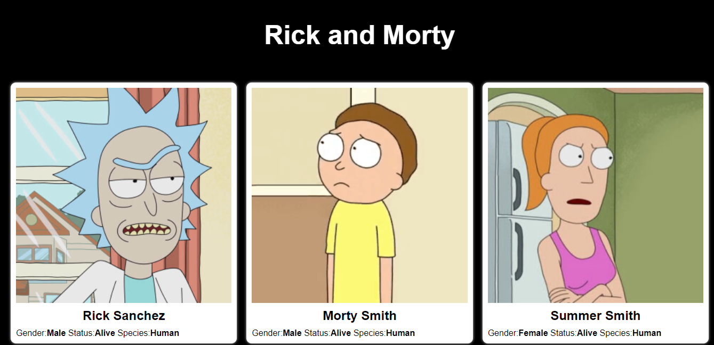

## Personajes de Rick and Morty

En este ejemplo estaremos consumiendo la API de **[Rick and Morty](https://rickandmortyapi.com/)**

La cual obtendra los datos del json [caracteres](https://rickandmortyapi.com/api/character), en el cual se encuentra la informacion de los personajes.

    

#    [Demo](https://rickm0rty.netlify.app/)

##   [Version con Angular](https://angular-api-rickandmorty.netlify.app/)
